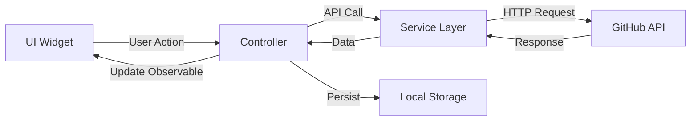

# Design Document

## Overview

The GitHub Repository Viewer is a Flutter application that provides a clean interface for browsing GitHub user repositories. The application follows a three-screen architecture: Authentication (username input), Home (repository list), and Details (repository information). The design leverages GetX for reactive state management, Dio for efficient HTTP communication, and GetStorage for local persistence.

### Key Design Principles

- **Reactive State Management**: All UI updates driven by GetX observables
- **Separation of Concerns**: Clear separation between UI, business logic, and data layers
- **Offline-First Theme**: Theme preferences persist across sessions
- **Error Resilience**: Graceful error handling with user-friendly messages and retry mechanisms
- **Performance**: Efficient list rendering with cached network images

## Architecture

### Layer Architecture

```
┌─────────────────────────────────────┐
│         Presentation Layer          │
│  (Screens, Widgets, Controllers)    │
└──────────────┬──────────────────────┘
               │
┌──────────────▼──────────────────────┐
│         Business Logic Layer        │
│     (GetX Controllers, Models)      │
└──────────────┬──────────────────────┘
               │
┌──────────────▼──────────────────────┐
│           Data Layer                │
│  (API Services, Local Storage)      │
└─────────────────────────────────────┘
```

### State Management Flow



## Components and Interfaces

### 1. Screens

#### AuthScreen
- **Purpose**: Username input and validation
- **Controller**: AuthController
- **Key Widgets**:
  - AppTextField for username input
  - AppButton for submission
  - Theme toggle icon button
  - Loading indicator during validation

#### HomeScreen
- **Purpose**: Display repository list with filtering and view mode switching
- **Controller**: HomeController
- **Key Widgets**:
  - AppBar with theme toggle and view mode toggle
  - Filter dropdown/bottom sheet
  - ListView.builder for list mode
  - GridView.builder for grid mode
  - Pull-to-refresh functionality
  - Empty state widget
  - Error state widget with retry

#### RepositoryDetailsScreen
- **Purpose**: Display detailed repository information
- **Controller**: RepositoryDetailsController
- **Key Widgets**:
  - Repository header with name and owner
  - Statistics cards (stars, forks, watchers)
  - Information sections (description, language, dates, URL)
  - Back navigation

### 2. Controllers

#### ThemeController (Global)
```dart
class ThemeController extends GetxController {
  final _isDarkMode = false.obs;
  final _storage = GetStorage();
  
  bool get isDarkMode => _isDarkMode.value;
  ThemeMode get themeMode => _isDarkMode.value ? ThemeMode.dark : ThemeMode.light;
  
  void toggleTheme();
  void loadTheme();
  void saveTheme();
}
```

#### AuthController
```dart
class AuthController extends GetxController {
  final _username = ''.obs;
  final _isLoading = false.obs;
  final _errorMessage = ''.obs;
  
  final GitHubService _gitHubService;
  
  Future<void> validateAndNavigate();
  String? validateUsername(String? value);
}
```

#### HomeController
```dart
class HomeController extends GetxController {
  final _repositories = <Repository>[].obs;
  final _isLoading = false.obs;
  final _errorMessage = ''.obs;
  final _viewMode = ViewMode.list.obs;
  final _sortOption = SortOption.name.obs;
  
  final GitHubService _gitHubService;
  final _storage = GetStorage();
  
  List<Repository> get sortedRepositories;
  
  Future<void> fetchRepositories(String username);
  void toggleViewMode();
  void setSortOption(SortOption option);
  void loadViewMode();
  void saveViewMode();
}
```

#### RepositoryDetailsController
```dart
class RepositoryDetailsController extends GetxController {
  final _repository = Rx<Repository?>(null);
  
  Repository? get repository => _repository.value;
  
  void setRepository(Repository repo);
}
```

### 3. Services

#### GitHubService
```dart
class GitHubService {
  final Dio _dio;
  
  static const String baseUrl = 'https://api.github.com';
  static const Duration timeout = Duration(seconds: 30);
  
  Future<GitHubUser> getUser(String username);
  Future<List<Repository>> getUserRepositories(String username);
}
```

### 4. Models

#### GitHubUser
```dart
class GitHubUser {
  final String login;
  final String avatarUrl;
  final String? name;
  final String? bio;
  final int publicRepos;
  
  factory GitHubUser.fromJson(Map<String, dynamic> json);
  Map<String, dynamic> toJson();
}
```

#### Repository
```dart
class Repository {
  final int id;
  final String name;
  final String? description;
  final String htmlUrl;
  final int stargazersCount;
  final int forksCount;
  final int watchersCount;
  final String? language;
  final DateTime createdAt;
  final DateTime updatedAt;
  final GitHubUser owner;
  
  factory Repository.fromJson(Map<String, dynamic> json);
  Map<String, dynamic> toJson();
}
```

### 5. Enums

```dart
enum ViewMode { list, grid }

enum SortOption { name, date, stars }
```

## Data Models

### API Response Structures

#### User Endpoint Response
```json
{
  "login": "username",
  "avatar_url": "https://...",
  "name": "Full Name",
  "bio": "User bio",
  "public_repos": 42
}
```

#### Repositories Endpoint Response
```json
[
  {
    "id": 123456,
    "name": "repo-name",
    "description": "Repository description",
    "html_url": "https://github.com/...",
    "stargazers_count": 100,
    "forks_count": 20,
    "watchers_count": 50,
    "language": "Dart",
    "created_at": "2024-01-01T00:00:00Z",
    "updated_at": "2024-11-01T00:00:00Z",
    "owner": { /* user object */ }
  }
]
```

### Local Storage Keys

- `theme_mode`: String ("light" or "dark")
- `view_mode`: String ("list" or "grid")
- `last_username`: String (optional, for convenience)

## Error Handling

### Error Types and Handling Strategy

1. **Network Errors**
   - Display: "Unable to connect. Please check your internet connection."
   - Action: Provide retry button
   - Implementation: Catch DioException with type DioExceptionType.connectionTimeout

2. **User Not Found (404)**
   - Display: "User '{username}' not found. Please check the username."
   - Action: Allow user to re-enter username
   - Implementation: Catch DioException with response?.statusCode == 404

3. **Rate Limit Exceeded (403)**
   - Display: "GitHub API rate limit exceeded. Please try again later."
   - Action: Show estimated reset time if available
   - Implementation: Parse X-RateLimit-Reset header

4. **Server Errors (500+)**
   - Display: "GitHub service is temporarily unavailable."
   - Action: Provide retry button
   - Implementation: Catch DioException with response?.statusCode >= 500

5. **Validation Errors**
   - Display: Inline validation messages
   - Action: Prevent submission until valid
   - Implementation: Form validation in AuthController

### Error Handling Flow

```dart
try {
  final response = await _dio.get(endpoint);
  return parseResponse(response);
} on DioException catch (e) {
  if (e.type == DioExceptionType.connectionTimeout) {
    throw NetworkException('Connection timeout');
  } else if (e.response?.statusCode == 404) {
    throw NotFoundException('User not found');
  } else if (e.response?.statusCode == 403) {
    throw RateLimitException('Rate limit exceeded');
  } else {
    throw ApiException('An error occurred');
  }
} catch (e) {
  throw UnknownException('Unexpected error');
}
```

## Routing and Navigation

### Route Configuration

```dart
class AppRoutes {
  static const String splash = '/';
  static const String auth = '/auth';
  static const String home = '/home';
  static const String repositoryDetails = '/repository-details';
}
```

### GetX Pages

```dart
final pages = [
  GetPage(
    name: AppRoutes.splash,
    page: () => SplashScreen(),
    binding: SplashBinding(),
  ),
  GetPage(
    name: AppRoutes.auth,
    page: () => AuthScreen(),
    binding: AuthBinding(),
  ),
  GetPage(
    name: AppRoutes.home,
    page: () => HomeScreen(),
    binding: HomeBinding(),
  ),
  GetPage(
    name: AppRoutes.repositoryDetails,
    page: () => RepositoryDetailsScreen(),
    binding: RepositoryDetailsBinding(),
  ),
];
```

### Navigation Flow

```
SplashScreen → AuthScreen → HomeScreen → RepositoryDetailsScreen
                    ↑            ↓
                    └────────────┘
                   (back navigation)
```

## UI/UX Design

### Theme Configuration

#### Light Theme
- Primary Color: #2196F3 (Blue)
- Background: #FFFFFF
- Surface: #F5F5F5
- Text Primary: #212121
- Text Secondary: #757575

#### Dark Theme
- Primary Color: #64B5F6 (Light Blue)
- Background: #121212
- Surface: #1E1E1E
- Text Primary: #FFFFFF
- Text Secondary: #B0B0B0

### View Modes

#### List View
- Full-width cards
- Vertical scrolling
- Shows: Repository name, description (2 lines max), language, stars
- Card height: ~100dp

#### Grid View
- 2 columns
- Square/rectangular cards
- Shows: Repository name, language, stars
- Responsive spacing

### Filter UI
- Bottom sheet or dropdown menu
- Options: Sort by Name, Sort by Date, Sort by Stars
- Visual indicator of current sort option
- Smooth animation on sort change

## Testing Strategy

### Unit Tests

1. **Controller Tests**
   - ThemeController: Toggle and persistence
   - AuthController: Username validation logic
   - HomeController: Sorting algorithms, view mode switching
   - RepositoryDetailsController: Data passing

2. **Service Tests**
   - GitHubService: Mock Dio responses
   - Test successful API calls
   - Test error scenarios (404, 403, timeout)

3. **Model Tests**
   - JSON serialization/deserialization
   - Edge cases (null values, missing fields)

### Widget Tests

1. **Screen Tests**
   - AuthScreen: Input validation, button states
   - HomeScreen: List/grid rendering, empty states
   - RepositoryDetailsScreen: Data display

2. **Custom Widget Tests**
   - AppTextField: Validation display
   - AppButton: Loading states
   - Repository cards: Data binding

### Integration Tests

1. **User Flows**
   - Complete flow: Enter username → View repos → View details → Back
   - Theme switching across screens
   - View mode persistence
   - Error recovery flows

2. **API Integration**
   - Real API calls with test accounts
   - Rate limit handling
   - Network error simulation

## Performance Considerations

### Optimization Strategies

1. **Image Caching**
   - Use cached_network_image for avatar and repository owner images
   - Implement placeholder and error widgets

2. **List Performance**
   - Use ListView.builder and GridView.builder for lazy loading
   - Implement const constructors where possible
   - Avoid rebuilding entire lists on sort

3. **State Management**
   - Use Obx for granular rebuilds
   - Avoid unnecessary controller dependencies
   - Dispose controllers properly

4. **API Efficiency**
   - Cache repository data in memory during session
   - Implement pull-to-refresh for manual updates
   - Consider pagination for users with many repositories (future enhancement)

## Dependencies

### Required Packages

```yaml
dependencies:
  flutter:
    sdk: flutter
  get: ^4.6.6                          # State management and routing
  dio: ^5.4.0                          # HTTP client
  get_storage: ^2.1.1                  # Local storage
  cached_network_image: ^3.3.1        # Image caching
  flutter_staggered_grid_view: ^0.7.0 # Grid layouts
  intl: ^0.19.0                        # Date formatting
```

### Dio Configuration

```dart
final dio = Dio(BaseOptions(
  baseUrl: 'https://api.github.com',
  connectTimeout: Duration(seconds: 30),
  receiveTimeout: Duration(seconds: 30),
  headers: {
    'Accept': 'application/vnd.github.v3+json',
  },
));
```

## Security Considerations

1. **API Token**: Currently using unauthenticated requests (60 requests/hour limit). Future enhancement: Add GitHub personal access token for higher rate limits
2. **Input Validation**: Sanitize username input to prevent injection attempts
3. **HTTPS**: All API calls use HTTPS
4. **Data Privacy**: No sensitive user data stored locally

## Future Enhancements

1. **Search Functionality**: Search within repositories
2. **Favorites**: Save favorite repositories locally
3. **Repository Content**: View README and file structure
4. **Multiple Users**: Switch between multiple GitHub users
5. **Pagination**: Handle users with 100+ repositories efficiently
6. **Offline Mode**: Cache repository data for offline viewing
